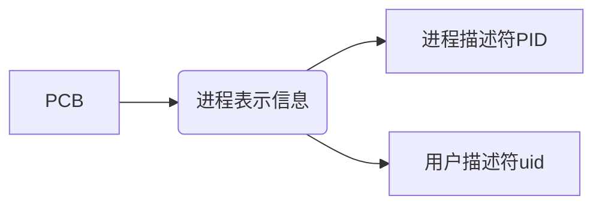
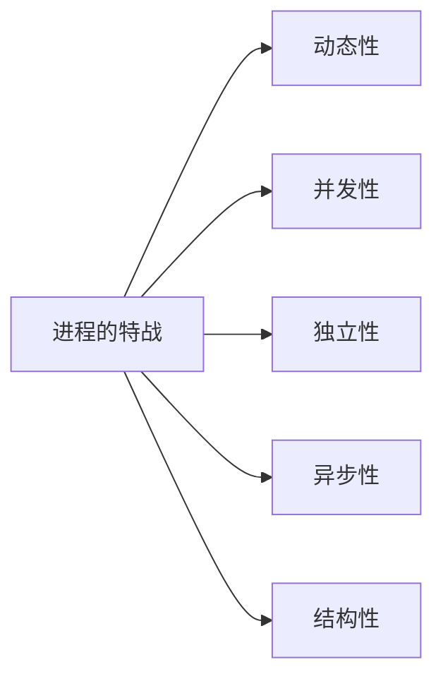

# 进程

## 定义

程序：就是一个指令序列

程序段、数据段

多道程序技术：PCB进程控制块，描述进程的各种信息（如程序代码存放位置）

程序段、数据段、PCB三部分组成了进程实体。

**注意：**PCB是进程存在的唯一标志

> >进程是进程实体的运行过程，是系统进行资源分配和调度的一个独立单位

## 组织

## 特战

## 进程的状态与转换

运行态：

就绪态：

阻塞态：等待分配资源

创建态：分配资源，初始化pcb

终止态：回收资源，撤销pcb

## 进程控制

### 定义

实现进程状态转换

### how

用原语实现进程控制（核心态下执行的特权指令）

创建原语、撤销原语、阻塞原语、唤醒原语、切换原语

## 进程通信

定义：进程之间的信息交换，一个进程不能直接访问另一个进程的地址空间

共享存储：分配共享空间，访问必须是互斥的

基于数据结构：

基于存储区：

管道通信：pipe文件，缓冲区，半双工、互斥访问

没写满，不允许读。没读完，不允许写

消息传递：消息头，消息体

直接通信方式：消息缓冲队列

间接通信方式：中间实体（信箱）发送原语，接收原语

## 线程概念和多线程模型

qq聊天，qq传送文件

qq进程里2个线程处理。

线程是一个基本的cpu执行单元

资源是分配给qq进程的

资源分配、调度

并发性

系统开销

用户级线程：对用户不透明，对操作系统透明

内核级线程：只有内核级线程才是处理机分配的单位

